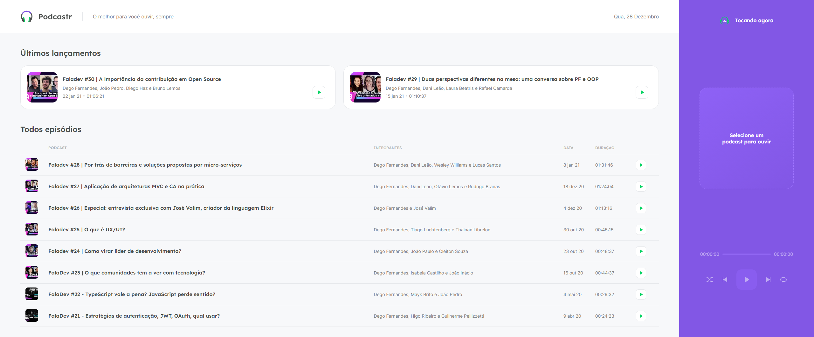
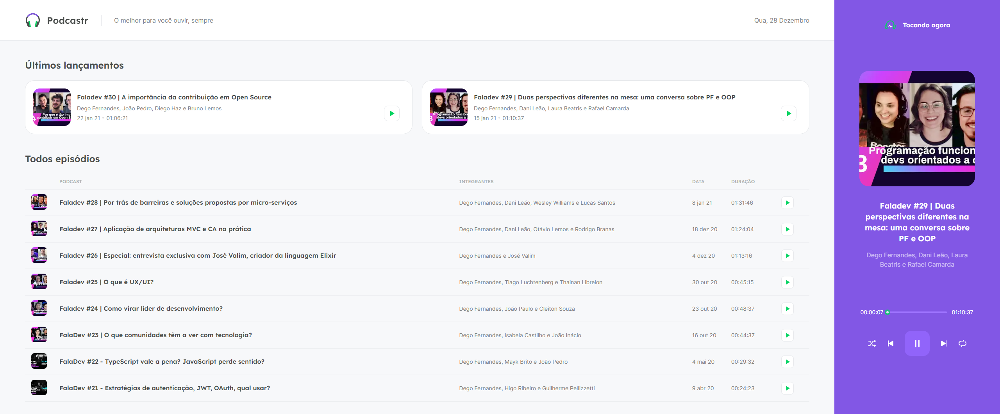
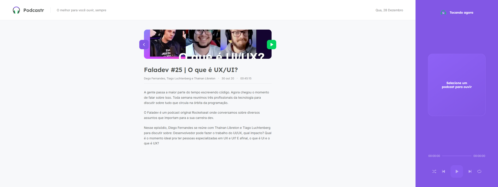

<p align="center">
  
</p>

<h1 align="center">
    
</h1>

<br>

## Tocando

<h1 align="center">
    
</h1>

<br>

## Episódio

<h1 align="center">
    
</h1>

## ⚙️ Tecnologias

Este projeto foi desenvolvido utilizando:

- [ReactJS](https://reactjs.org/)
- [NextJS](https://nextjs.org/)
- [TypeScript](https://www.typescriptlang.org/)
- [SASS](https://sass-lang.com/)

## 📌 Começando

Clone o projeto:

```bash
git clone https://github.com/gabrielcoutinh0/Podcastr-NLW-5.git
cd Podecastr-NLW-5
```

Instale as dependências :

```bash
yarn install

# Rodar o backend fake server
yarn server

yarn dev
```

## 🖼️ Inspiração

- [Figma](https://www.figma.com/file/UwFEntsHpHYJlHNQAQr4gA/Podcastr/duplicate)

Projeto desenvolvido na trilha React do Next Level Week #05
